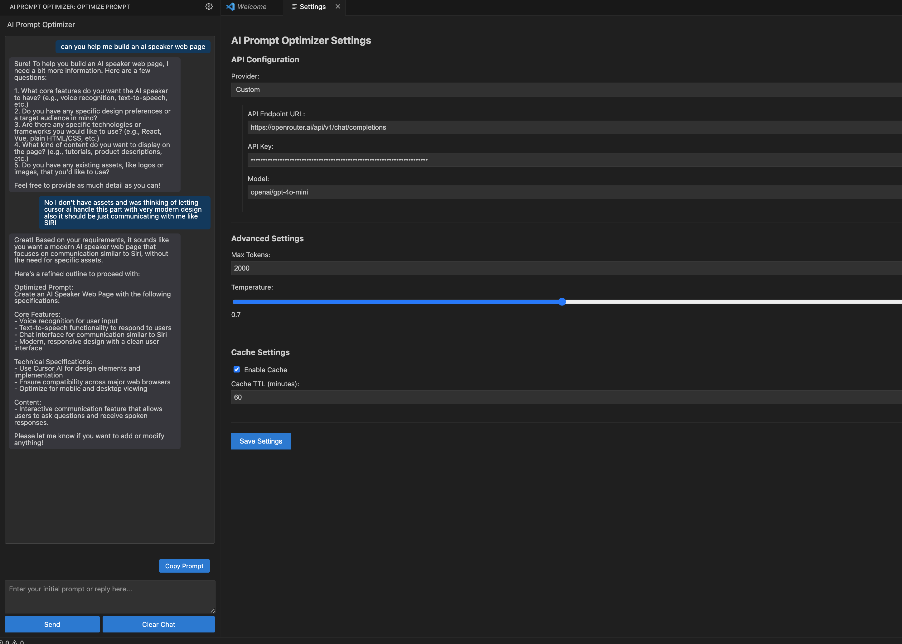

# AI Prompt Optimizer

AI Prompt Optimizer 💡

Enhance your coding productivity with **AI Prompt Optimizer**, a Visual Studio Code extension designed to help developers craft precise and effective prompts for AI coding tools like Cursor AI, Continue Dev, and others. Whether you're implementing features, debugging code, or seeking explanations, this extension streamlines your workflow by optimizing prompts and integrating seamlessly into your development environment.

---

## Features

- **Prompt Optimization**: Transform vague ideas into clear, actionable prompts tailored for AI assistants.
- **Interactive Chat Interface**: Engage in a conversational UI within VS Code to refine your prompts step-by-step.
- **Template Support**: Use predefined templates for common coding tasks (e.g., React components, API endpoints) or create your own.
- **Context Awareness**: Analyzes your workspace to provide relevant suggestions based on your project’s language, frameworks, and dependencies.
- **Configurable API Integration**: Supports multiple AI providers (OpenAI, OpenRouter, Anthropic) with customizable settings.
- **Caching**: Speeds up repetitive tasks by caching prompt responses with configurable TTL.
- **Copy to Clipboard**: Easily copy optimized prompts using the provided copy prompt button.
- **VS Code Native Styling**: Matches VS Code’s look and feel for a seamless experience.



---

## Installation

1. **Via VS Code Marketplace** (Recommended):
   - Search for "AI Prompt Optimizer" in the [VS Code Marketplace](https://marketplace.visualstudio.com/vscode).
   - Click **Install**.

2. **Manual Installation**:
   - Download the `.vsix` file from the [releases page](#) (coming soon).
   - Open VS Code, go to **Extensions** (`Ctrl+Shift+X` or `Cmd+Shift+X` on Mac), click the `...` menu, and select **Install from VSIX**.
   - Select the downloaded `.vsix` file.

---

## Usage

1. **Open the Extension**:
   - Access it from the Activity Bar (look for the lightbulb icon) or use the command `AI Prompt Optimizer: Show View` (`Ctrl+Shift+P` or `Cmd+Shift+P`).

2. **Enter Your Prompt**:
   - Type your initial idea or question in the text area (e.g., "Help me build a React component").

3. **Optimize Your Prompt**:
   - Click **Send** or press `Enter` to receive an optimized prompt with detailed specifications.
   - Refine it further through the conversational interface if needed.

4. **Copy and Use**:
   - Use the **Copy Prompt** button to copy the optimized prompt and paste it into your preferred AI tool.

5. **Configure Settings**:
   - Click the gear icon in the header or run `AI Prompt Optimizer: Configure` to set up your API provider, model, and other preferences.

**Example Animation**:


---

## Requirements

- **VS Code**: Version 1.87.0 or higher.
- **API Key**: An API key from a supported provider (OpenAI, OpenRouter, or Anthropic) is required for AI functionality. Configure this in the settings.
- **Internet Connection**: Required for API calls.

---

## Extension Settings

This extension contributes the following settings, accessible via VS Code’s settings UI or `settings.json`:

- `aiPromptOptimizer.api.defaultProvider`: Set the default AI provider (`openai`, `openrouter`, `anthropic`, or `custom`).
- `aiPromptOptimizer.api.maxTokens`: Maximum tokens for AI responses (default: 2000).
- `aiPromptOptimizer.cache.enabled`: Enable/disable prompt caching (default: true).
- `aiPromptOptimizer.ui.theme`: Set the UI theme (`light`, `dark`, or `auto`).

Example `settings.json`:
```json
{
  "aiPromptOptimizer.api.defaultProvider": "openai",
  "aiPromptOptimizer.api.openai.apiKey": "your-api-key-here",
  "aiPromptOptimizer.api.maxTokens": 3000
}
```
---

## Known Issues

- **API Configuration**: Missing or invalid API keys may cause errors. Ensure proper setup in the settings.
- **Large Projects**: Context analysis might be slow in very large workspaces. Adjust `context.scanDepth` if needed.
- **Experimental Features**: Streaming responses and multimodal prompts are not yet fully supported.

File issues on our [GitHub repository](https://github.com/mhemdan/ai-prompt-optimizer) if you encounter bugs!

---

## Release Notes

### 0.0.1 (Unreleased)
- Initial release with core prompt optimization, UI, and API integration.
- Support for OpenAI, OpenRouter, and Anthropic.
- Basic template engine and context analysis.

---

## Contributing

We welcome contributions! Here’s how to get started:

1. Fork the repository on [GitHub](https://github.com/mhemdan/ai-prompt-optimizer).
2. Clone your fork: `git clone https://github.com/mhemdan/ai-prompt-optimizer.git`.
3. Install dependencies: `npm install`.
4. Make changes and test locally with `npm run watch` and `F5` in VS Code.
5. Submit a pull request with a clear description of your changes.

See [CONTRIBUTING.md](CONTRIBUTING.md) for detailed guidelines.

---

## License

This extension is licensed under the [MIT License](./LICENSE). See the [LICENSE](./LICENSE) file for details.

---

## Acknowledgments

- Built with ❤️ by [Mohamed Hemdan](https://github.com/mhemdan).
- Thanks to the VS Code team for their amazing API and documentation.
- Inspired by the needs of developers using AI-powered coding tools.

---

## Get in Touch

- **Issues & Feedback**: [GitHub Issues](https://github.com/mhemdan/ai-prompt-optimizer/issues)
- **Linkedin**: [@mhemdanfaraj](https://www.linkedin.com/in/mhemdanfaraj)
- **Email**: mohammed.hemdan.faraj@gmail.com

**Happy Coding!**